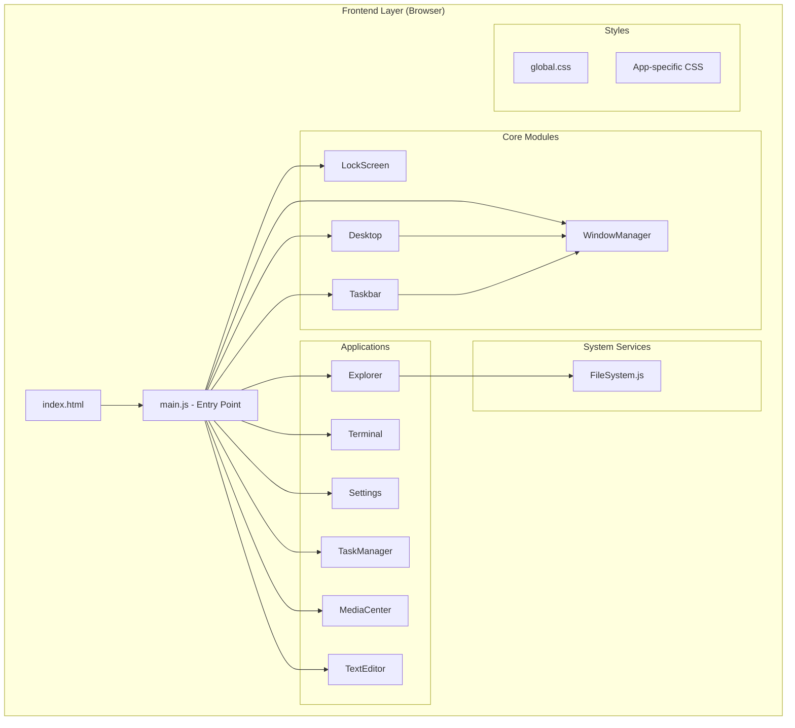
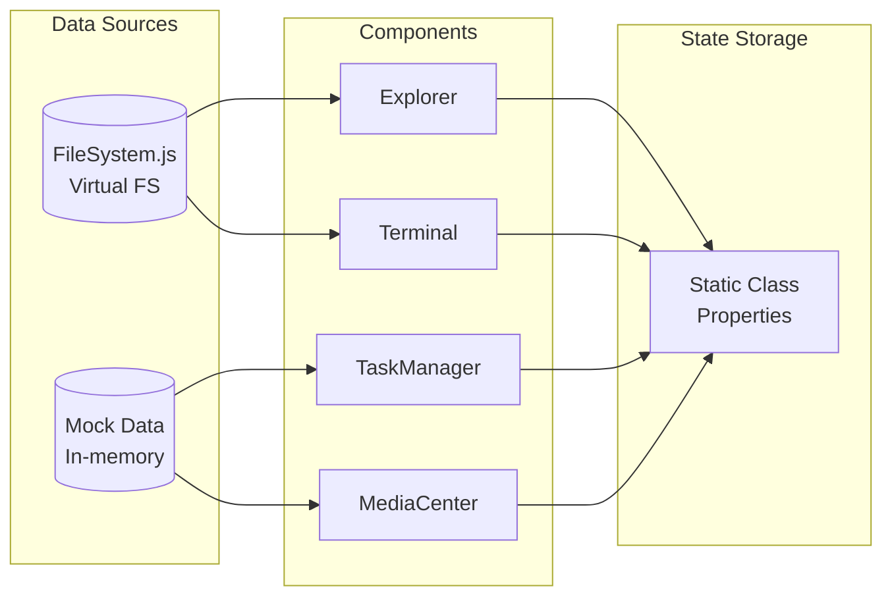
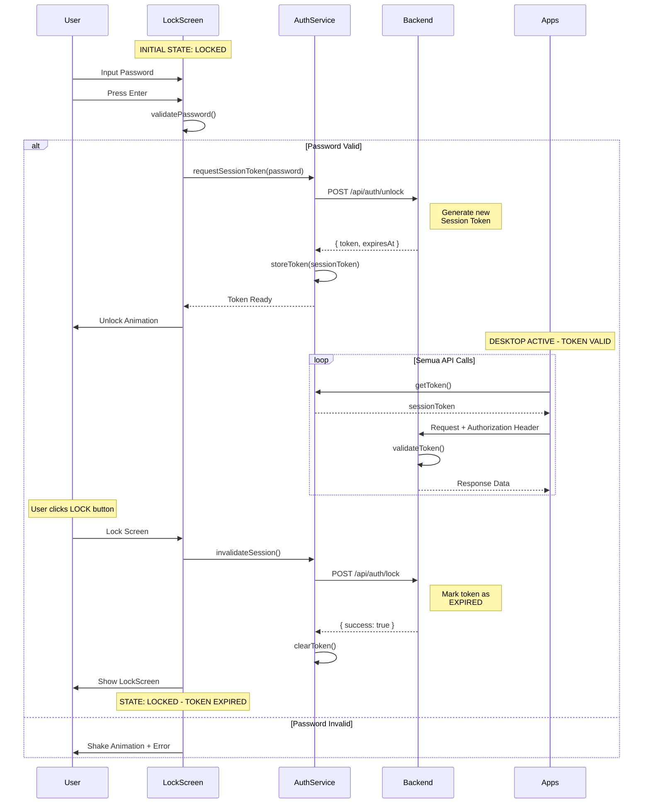
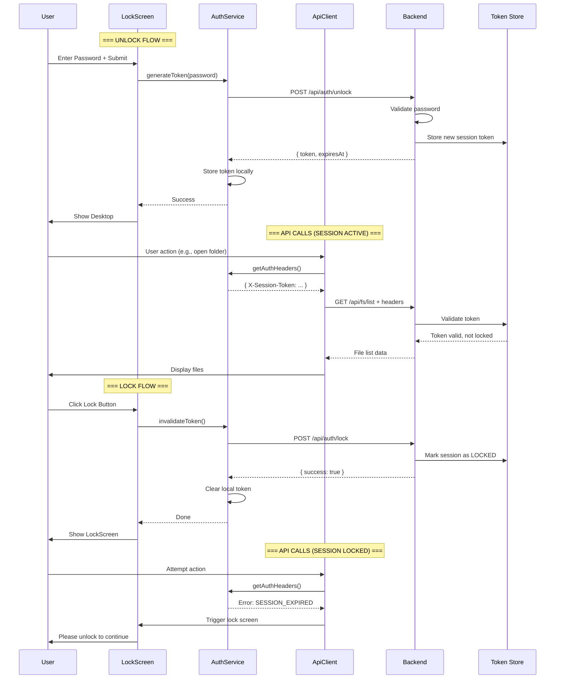
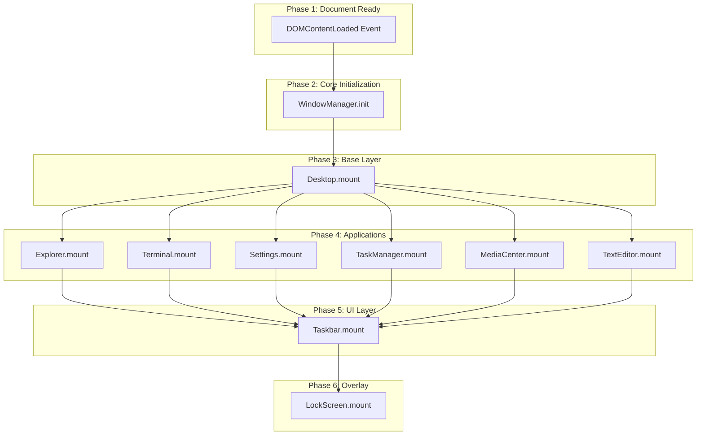
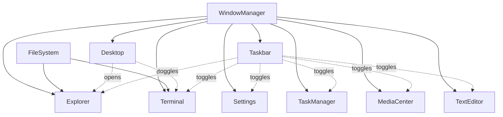
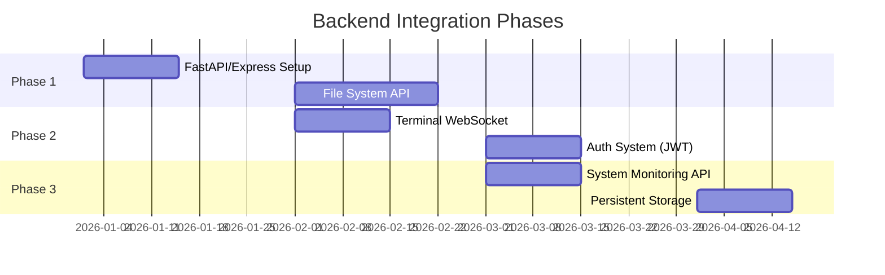

# Analisis Teknis LinuxUI - Dokumentasi Lengkap

> **Tanggal Analisis:** 10 Januari 2026  
> **Tech Stack:** Vite 5.0, Vanilla JavaScript ES6, CSS3

---

## Daftar Isi

1. [Ikhtisar Arsitektur](#1-ikhtisar-arsitektur)
2. [Struktur Direktori Proyek](#2-struktur-direktori-proyek)
3. [Komponen Aplikasi](#3-komponen-aplikasi)
4. [Arsitektur Data](#4-arsitektur-data)
5. [Protokol Komunikasi & API](#5-protokol-komunikasi--api)
6. [Sistem Keamanan & Autentikasi](#6-sistem-keamanan--autentikasi)
7. [Hierarki Pemuatan Data](#7-hierarki-pemuatan-data-loading-priority)
8. [Konfigurasi Aplikasi](#8-konfigurasi-aplikasi)
9. [Rekomendasi Pengembangan](#9-rekomendasi-pengembangan)

---

## 1. Ikhtisar Arsitektur

### 1.1 Deskripsi Umum

LinuxUI adalah aplikasi **simulasi desktop Linux berbasis web** yang berjalan sepenuhnya di sisi klien (frontend-only). Aplikasi ini meniru tampilan dan fungsionalitas sistem operasi desktop dengan komponen-komponen seperti:

- **Window Manager** untuk pengelolaan jendela
- **Desktop Environment** dengan ikon dan grid system
- **Taskbar** dengan start menu, tray icons, dan calendar
- **Multiple Applications** (Explorer, Terminal, Settings, dll.)

### 1.2 Diagram Arsitektur



### 1.3 Technology Stack

| Komponen        | Teknologi                        | Versi   |
| --------------- | -------------------------------- | ------- |
| Build Tool      | Vite                             | ^5.0.0  |
| Package Manager | npm                              | -       |
| Language        | Vanilla JavaScript (ES6 Modules) | ES2020+ |
| Styling         | CSS3 + CSS Custom Properties     | -       |
| Module System   | ES Modules                       | Native  |

---

## 2. Struktur Direktori Proyek

```
LinuxUI/
├── index.html              # Entry point HTML
├── package.json            # Dependensi & scripts npm
├── package-lock.json       # Lock file
├── vite.config.js          # Konfigurasi Vite
│
└── src/
    ├── main.js             # Application bootstrap
    │
    ├── core/               # Modul inti sistem
    │   ├── Desktop/
    │   │   ├── Desktop.js
    │   │   └── style.css
    │   ├── LockScreen/
    │   │   ├── LockScreen.js
    │   │   └── style.css
    │   ├── Taskbar/
    │   │   ├── Taskbar.js
    │   │   └── style.css
    │   └── WindowManager/
    │       └── WindowManager.js
    │
    ├── apps/               # Aplikasi desktop
    │   ├── Explorer/
    │   │   ├── Explorer.js
    │   │   └── style.css
    │   ├── MediaCenter/
    │   │   ├── MediaCenter.js
    │   │   └── style.css
    │   ├── Settings/
    │   │   ├── Settings.js
    │   │   └── style.css
    │   ├── TaskManager/
    │   │   ├── TaskManager.js
    │   │   └── style.css
    │   ├── Terminal/
    │   │   ├── Terminal.js
    │   │   └── style.css
    │   └── TextEditor/
    │       ├── TextEditor.js
    │       └── style.css
    │
    ├── system/             # System services
    │   └── FileSystem.js
    │
    └── styles/
        └── global.css      # Global styles & CSS variables
```

---

## 3. Komponen Aplikasi

### 3.1 Core Modules

#### 3.1.1 WindowManager

| Property    | Deskripsi                                 |
| ----------- | ----------------------------------------- |
| **File**    | `src/core/WindowManager/WindowManager.js` |
| **Lines**   | 127 lines                                 |
| **Pattern** | Static Class (Singleton)                  |

**Fungsionalitas:**
- Manajemen Z-Index untuk window stacking
- Drag & drop window movement
- Window states: open, close, minimize, maximize
- Event delegation untuk mouse events

**API Methods:**

```javascript
WindowManager.init()              // Inisialisasi global listeners
WindowManager.toggleWindow(id)    // Toggle visibility window
WindowManager.openWindow(id)      // Buka window
WindowManager.closeWindow(id)     // Tutup window
WindowManager.maximizeWindow(id)  // Toggle maximize
WindowManager.minimizeWindow(id)  // Minimize window
WindowManager.bringToFront(el)    // Naikkan z-index
WindowManager.startDrag(e, id)    // Mulai drag
WindowManager.dragElement(e)      // Handler drag movement
WindowManager.stopDrag()          // Akhiri drag
```

**State Management:**

```javascript
static zIndexCounter = 100;  // Counter untuk z-index
static isDragging = false;   // Flag status dragging
static dragData = {          // Data untuk drag operation
    startX: 0, 
    startY: 0, 
    initialLeft: 0, 
    initialTop: 0, 
    currentWindow: null 
};
```

---

#### 3.1.2 LockScreen

| Property    | Deskripsi                           |
| ----------- | ----------------------------------- |
| **File**    | `src/core/LockScreen/LockScreen.js` |
| **Lines**   | 71 lines                            |
| **Pattern** | Static Class                        |

**Fungsionalitas:**
- Layar kunci dengan input password
- Animasi unlock (slide up)
- Shake animation untuk password salah

**API Methods:**

```javascript
LockScreen.mount(container)    // Render lockscreen ke container
LockScreen.attachListeners()   // Setup event handlers
LockScreen.checkUnlock(e)      // Handler Enter key
LockScreen.performUnlock()     // Validasi & unlock
```

**Autentikasi (Mock):**
```javascript
// Password yang diterima:
// - "123" (demo password)
// - "" (empty untuk demo mode)
```

---

#### 3.1.3 Desktop

| Property    | Deskripsi                     |
| ----------- | ----------------------------- |
| **File**    | `src/core/Desktop/Desktop.js` |
| **Lines**   | 354 lines                     |
| **Pattern** | Static Class                  |

**Fungsionalitas:**
- Grid-based icon placement (20x10 grid)
- Icon drag & drop dengan snap-to-grid
- Context menu (right-click)
- Desktop shortcuts management

**API Methods:**

```javascript
Desktop.mount(container)              // Render desktop
Desktop.initializeGrid()              // Setup grid system
Desktop.placeIconAtGrid(icon, col, row)  // Place icon
Desktop.getGridFromPosition(x, y)     // Koordinat ke grid cell
Desktop.findNearestFreeCell(col, row) // Cari cell kosong
Desktop.attachListeners()             // Event handlers
Desktop.closeAllMenus()               // Tutup context menus
Desktop.handleContextAction(action)   // Handle context menu
Desktop.handleIconAction(action)      // Handle icon actions
Desktop.arrangeIcons()                // Auto-arrange icons
```

**Konfigurasi Grid:**
```javascript
static GRID_SIZE = 100;  // Ukuran cell dalam pixel
static GRID_COLS = 20;   // Jumlah kolom
static GRID_ROWS = 10;   // Jumlah baris
static occupiedCells = new Set();  // Cell yang terpakai
```

---

#### 3.1.4 Taskbar

| Property    | Deskripsi                     |
| ----------- | ----------------------------- |
| **File**    | `src/core/Taskbar/Taskbar.js` |
| **Lines**   | 595 lines                     |
| **Pattern** | Static Class                  |

**Fungsionalitas:**
- Start menu dengan pencarian aplikasi
- System tray (WiFi, Volume, Battery)
- Calendar widget denga navigasi bulan
- Quick notes
- Real-time clock

**API Methods:**

```javascript
Taskbar.mount(container)             // Render taskbar
Taskbar.attachListeners()            // Event handlers
Taskbar.addNote(text)                // Tambah note
Taskbar.closeAllPopups()             // Tutup semua popup
Taskbar.togglePopup(id)              // Toggle popup visibility
Taskbar.startClock()                 // Jalankan clock updater
Taskbar.renderCalendar(date)         // Render calendar grid
Taskbar.prevMonth() / nextMonth()    // Navigasi kalender
Taskbar.showAppContextMenu(e, card)  // Context menu aplikasi
Taskbar.handleAppContextAction(action)  // Handle context
Taskbar.addIconToDesktop(appId, appName)  // Pin to desktop
```

---

### 3.2 Applications

#### 3.2.1 Explorer (File Manager)

| Property    | Deskripsi                       |
| ----------- | ------------------------------- |
| **File**    | `src/apps/Explorer/Explorer.js` |
| **Lines**   | 799 lines                       |
| **Pattern** | Static Class                    |

**Fitur:**
- Navigasi filesystem virtual
- Breadcrumb navigation
- Dual view mode (grid/list)
- Context menu dengan operasi file
- File tooltips dengan info detail
- Network connection simulator
- Clipboard (cut/copy/paste)

**State:**
```javascript
static currentPath = '/home/user';  // Path aktif
static contextTarget = null;        // Target context menu
static viewMode = 'grid';           // grid | list
static showHidden = false;          // Show hidden files
static clipboard = null;            // Clipboard data
static clipboardAction = null;      // cut | copy
```

**File Operations:**
- Open, Cut, Copy, Paste, Delete, Rename
- New Folder, New File
- Toggle Hidden Files
- Connect to Network (mock)

---

#### 3.2.2 Terminal

| Property    | Deskripsi                       |
| ----------- | ------------------------------- |
| **File**    | `src/apps/Terminal/Terminal.js` |
| **Lines**   | 266 lines                       |
| **Pattern** | Static Class                    |

**Fitur:**
- Multi-tab terminal
- Command history per tab
- Built-in commands

**Commands Tersedia:**
```
help     - Tampilkan daftar perintah
clear    - Bersihkan terminal
date     - Tampilkan tanggal/waktu
ls/list  - List direktori
pwd      - Print working directory
whoami   - Tampilkan user
uname    - System information
neofetch - System info dengan ASCII art
exit     - Tutup tab
cd       - Change directory
cat      - Display file content
echo     - Echo text
```

---

#### 3.2.3 Settings

| Property    | Deskripsi                       |
| ----------- | ------------------------------- |
| **File**    | `src/apps/Settings/Settings.js` |
| **Lines**   | 495 lines                       |
| **Pattern** | Static Class                    |

**Sections:**
- **System** - Info & About
- **Display** - Resolution, brightness
- **Personalization** - Themes, wallpaper
- **Network** - WiFi, Ethernet
- **Apps** - Installed apps
- **Privacy** - Security settings
- **Time & Language** - Locale settings
- **Accessibility** - A11y options
- **Update** - System updates

---

#### 3.2.4 TaskManager

| Property    | Deskripsi                             |
| ----------- | ------------------------------------- |
| **File**    | `src/apps/TaskManager/TaskManager.js` |
| **Lines**   | 351 lines                             |
| **Pattern** | Static Class                          |

**Tabs:**
- **Processes** - Running processes (mock data)
- **Performance** - CPU/Memory graphs
- **Startup** - Autostart programs
- **Services** - System services

**Performance Monitoring:**
```javascript
static currentPerfTab = 'cpu';
static cpuHistory = [];   // History data untuk grafik
static memHistory = [];   // Memory history

// Update interval: 1000ms
startPerformanceMonitor()  // Random data generator
renderMiniGraph(containerId, data, color)  // Canvas graphs
```

---

#### 3.2.5 MediaCenter

| Property    | Deskripsi                             |
| ----------- | ------------------------------------- |
| **File**    | `src/apps/MediaCenter/MediaCenter.js` |
| **Lines**   | 310 lines                             |
| **Pattern** | Static Class                          |

**Fitur:**
- Media library dengan mock data
- Filter: All, Music, Videos, Photos
- Media player bar dengan controls
- Play/pause toggle

**Mock Data Sample:**
```javascript
static mockMedia = [
    { id: 1, name: 'Summer Vibes', artist: 'Chill Artist', 
      type: 'music', thumb: '#1db954', duration: '3:45' },
    // ... more items
];
```

---

#### 3.2.6 TextEditor

| Property    | Deskripsi                           |
| ----------- | ----------------------------------- |
| **File**    | `src/apps/TextEditor/TextEditor.js` |
| **Lines**   | 319 lines                           |
| **Pattern** | Static Class                        |

**Fitur:**
- Basic text editing
- File operations (New, Open, Save)
- Edit operations (Undo, Cut, Copy, Paste)
- Word wrap toggle
- Line/column indicator
- Status bar

**State:**
```javascript
static currentFileName = 'Untitled';
static isModified = false;
static wordWrap = true;
```

---

## 4. Arsitektur Data

### 4.1 FileSystem (Virtual)

> **Lokasi:** `src/system/FileSystem.js`

Sistem file virtual berbasis JavaScript object tree:

```javascript
export const fileSystem = {
    "home": {
        "user": {
            "Documents": {
                "Work": {
                    "Project_Alpha": {
                        "Specs.docx": "file",
                        "Assets": {
                            "Logo.png": "file",
                            "Banner.jpg": "file"
                        }
                    },
                    "Report_2025.pdf": "file"
                },
                "Personal": { "Resume.pdf": "file" },
                "Notes.txt": "file"
            },
            "Downloads": { ... },
            "Music": { ... },
            "Pictures": { ... },
            "Videos": { ... },
            "Desktop": {}
        }
    },
    "mnt": {
        "vol1": { "Backup_Data": {}, "Games": { ... } },
        "linux-os": { "bin": {}, "etc": {}, "usr": {}, "var": {} }
    }
};
```

**API:**
```javascript
FileSystem.resolvePath(path)  // Resolve path ke object node
// Returns: object (folder contents) | null (not found)
```

### 4.2 Data Flow Diagram



### 4.3 State Management Pattern

Aplikasi menggunakan **Static Class Properties** sebagai state store:

| Komponen    | State Location                                    | Persistence  |
| ----------- | ------------------------------------------------- | ------------ |
| Explorer    | `Explorer.currentPath`, `Explorer.clipboard`      | Session only |
| Terminal    | `Terminal.commandHistory`, `Terminal.activeTabId` | Session only |
| TaskManager | `TaskManager.cpuHistory`                          | Session only |
| Settings    | `Settings.currentSection`                         | Session only |

> ⚠️ **Catatan:** Tidak ada persistent storage (localStorage/IndexedDB) yang diimplementasikan saat ini.

---

## 5. Protokol Komunikasi & API

### 5.1 Status Implementasi Saat Ini

> [!IMPORTANT]
> **Aplikasi ini saat ini adalah frontend-only application.**  
> Tidak ada komunikasi jaringan (HTTP/HTTPS, WebSocket, REST API) yang diimplementasikan.

| Protokol            | Status            | Catatan |
| ------------------- | ----------------- | ------- |
| HTTP/HTTPS REST API | ❌ Tidak Ada       | -       |
| WebSocket           | ❌ Tidak Ada       | -       |
| Fetch API           | ❌ Tidak Digunakan | -       |
| Server-Sent Events  | ❌ Tidak Ada       | -       |
| IndexedDB           | ❌ Tidak Ada       | -       |
| LocalStorage        | ❌ Tidak Digunakan | -       |

### 5.2 Endpoint Placeholder (Future Implementation)

Berdasarkan struktur komponen, berikut endpoint yang **direncanakan/direkomendasikan**:

#### File System API

| Method   | Endpoint               | Deskripsi               |
| -------- | ---------------------- | ----------------------- |
| `GET`    | `/api/fs/list?path=`   | List directory contents |
| `GET`    | `/api/fs/read?path=`   | Read file content       |
| `POST`   | `/api/fs/write`        | Write/create file       |
| `POST`   | `/api/fs/mkdir`        | Create directory        |
| `DELETE` | `/api/fs/delete?path=` | Delete file/folder      |
| `POST`   | `/api/fs/move`         | Move/rename file        |
| `POST`   | `/api/fs/copy`         | Copy file               |

**Request/Response Example:**
```http
GET /api/fs/list?path=/home/user/Documents
Authorization: Bearer <token>

Response:
{
  "success": true,
  "data": {
    "path": "/home/user/Documents",
    "items": [
      { "name": "Work", "type": "directory", "size": null },
      { "name": "Notes.txt", "type": "file", "size": 1024 }
    ]
  }
}
```

#### Terminal WebSocket API

| Event        | Direction     | Payload                             |
| ------------ | ------------- | ----------------------------------- |
| `connect`    | Client→Server | `{ tabId: string }`                 |
| `command`    | Client→Server | `{ cmd: string, tabId: string }`    |
| `output`     | Server→Client | `{ output: string, tabId: string }` |
| `disconnect` | Bidirectional | `{ tabId: string }`                 |

```javascript
// WebSocket URL (recommended)
ws://localhost:8000/api/terminal/ws

// Connection flow
const ws = new WebSocket('ws://localhost:8000/api/terminal/ws');
ws.onopen = () => ws.send(JSON.stringify({ type: 'connect', tabId: '1' }));
ws.onmessage = (e) => handleOutput(JSON.parse(e.data));
```

#### System Info API

| Method | Endpoint                  | Deskripsi         |
| ------ | ------------------------- | ----------------- |
| `GET`  | `/api/system/info`        | OS info, hostname |
| `GET`  | `/api/system/processes`   | Running processes |
| `GET`  | `/api/system/performance` | CPU/Memory stats  |
| `GET`  | `/api/system/services`    | System services   |

---

## 6. Sistem Keamanan & Autentikasi

### 6.1 Arsitektur LockScreen Session Token

> [!IMPORTANT]
> **Konsep Utama:** Setiap kali user **unlock screen**, sistem otomatis men-generate **Session Token** baru yang digunakan untuk semua komunikasi API dengan backend. Token ini akan **expired** ketika user menekan tombol **Lock** untuk masuk mode lockscreen.

#### 6.1.1 Prinsip Kerja

| State                          | Token Status             | API Access                |
| ------------------------------ | ------------------------ | ------------------------- |
| **Unlocked** (Desktop aktif)   | ✅ Token Valid            | ✅ Semua API dapat diakses |
| **Locked** (LockScreen tampil) | ❌ Token Expired          | ❌ API menolak request     |
| **Transisi Lock→Unlock**       | 🔄 Token baru di-generate | ✅ Session baru dimulai    |
| **Transisi Unlock→Lock**       | 🗑️ Token diinvalidasi     | ❌ Backend notified        |

#### 6.1.2 Diagram Alur Otentikasi



### 6.2 Komponen AuthService

> **Lokasi File (Recommended):** `src/system/AuthService.js`

#### 6.2.1 State Management

```javascript
// src/system/AuthService.js
export class AuthService {
    static sessionToken = null;      // Current session token
    static tokenExpiry = null;       // Token expiry timestamp
    static isLocked = true;          // LockScreen state
    static userId = null;            // Current user ID
    
    // Token configuration
    static TOKEN_HEADER = 'X-Session-Token';
    static LOCK_STATE_HEADER = 'X-LockScreen-State';
}
```

#### 6.2.2 API Methods

```javascript
// Generate token saat unlock
static async generateToken(password) {
    const response = await fetch('/api/auth/unlock', {
        method: 'POST',
        headers: { 'Content-Type': 'application/json' },
        body: JSON.stringify({ password })
    });
    
    if (response.ok) {
        const { token, expiresAt, userId } = await response.json();
        this.sessionToken = token;
        this.tokenExpiry = new Date(expiresAt);
        this.userId = userId;
        this.isLocked = false;
        return true;
    }
    return false;
}

// Invalidate token saat lock
static async invalidateToken() {
    if (this.sessionToken) {
        await fetch('/api/auth/lock', {
            method: 'POST',
            headers: { 
                'Content-Type': 'application/json',
                [this.TOKEN_HEADER]: this.sessionToken
            }
        });
    }
    this.sessionToken = null;
    this.tokenExpiry = null;
    this.isLocked = true;
}

// Get current token untuk API calls
static getAuthHeaders() {
    if (!this.sessionToken || this.isTokenExpired()) {
        throw new Error('SESSION_EXPIRED');
    }
    return {
        [this.TOKEN_HEADER]: this.sessionToken,
        [this.LOCK_STATE_HEADER]: this.isLocked ? 'locked' : 'unlocked'
    };
}

// Check token validity
static isTokenExpired() {
    if (!this.tokenExpiry) return true;
    return new Date() >= this.tokenExpiry;
}

// Check if session is active
static isSessionActive() {
    return !this.isLocked && this.sessionToken && !this.isTokenExpired();
}
```

### 6.3 Integrasi dengan LockScreen

#### 6.3.1 Modifikasi LockScreen.js

```javascript
import { AuthService } from '../../system/AuthService.js';

export class LockScreen {
    // ... existing code ...
    
    static async performUnlock() {
        const password = document.getElementById('ls-pass').value;
        
        // Generate new session token via backend
        const success = await AuthService.generateToken(password);
        
        if (success) {
            const lockScreen = document.getElementById('lockscreen');
            lockScreen.style.top = '-100%';
            console.log('Session started with new token');
        } else {
            this.showError();
        }
    }
    
    // Called when user presses Lock button
    static async performLock() {
        // Notify backend & invalidate token
        await AuthService.invalidateToken();
        
        // Show lockscreen
        const lockScreen = document.getElementById('lockscreen');
        lockScreen.style.top = '0';
        document.getElementById('ls-pass').value = '';
        
        console.log('Session ended, token invalidated');
    }
}
```

### 6.4 Backend API Endpoints untuk Otentikasi

#### 6.4.1 Endpoint Definitions

| Method | Endpoint            | Deskripsi                | Auth Required     |
| ------ | ------------------- | ------------------------ | ----------------- |
| `POST` | `/api/auth/unlock`  | Generate session token   | ❌ (password only) |
| `POST` | `/api/auth/lock`    | Invalidate session token | ✅ Session Token   |
| `GET`  | `/api/auth/status`  | Check session status     | ✅ Session Token   |
| `POST` | `/api/auth/refresh` | Refresh token (optional) | ✅ Session Token   |

#### 6.4.2 Request/Response Specifications

**POST /api/auth/unlock** - Generate Token
```http
POST /api/auth/unlock
Content-Type: application/json

Request:
{
    "password": "user_password",
    "clientId": "webui-client-001"
}

Response (200 OK):
{
    "success": true,
    "token": "sess_abc123xyz789...",
    "expiresAt": "2026-01-10T22:00:00Z",
    "userId": "user",
    "permissions": ["fs_read", "fs_write", "terminal", "system_info"]
}

Response (401 Unauthorized):
{
    "success": false,
    "error": "INVALID_PASSWORD",
    "message": "Password tidak valid"
}
```

**POST /api/auth/lock** - Invalidate Token
```http
POST /api/auth/lock
Content-Type: application/json
X-Session-Token: sess_abc123xyz789...

Request:
{
    "reason": "user_initiated"  // or "timeout", "forced"
}

Response (200 OK):
{
    "success": true,
    "message": "Session terminated",
    "lockedAt": "2026-01-10T21:30:00Z"
}
```

**GET /api/auth/status** - Check Session
```http
GET /api/auth/status
X-Session-Token: sess_abc123xyz789...

Response (200 OK):
{
    "isValid": true,
    "isLocked": false,
    "userId": "user",
    "expiresAt": "2026-01-10T22:00:00Z",
    "remainingSeconds": 1800
}

Response (401 - Token Expired):
{
    "isValid": false,
    "error": "TOKEN_EXPIRED",
    "message": "Session telah expired, silakan unlock untuk melanjutkan"
}
```

### 6.5 Penggunaan Token di Semua API Calls

#### 6.5.1 Fetch Wrapper dengan Auto-Auth

```javascript
// src/system/ApiClient.js
import { AuthService } from './AuthService.js';

export class ApiClient {
    static BASE_URL = 'http://localhost:8000/api';
    
    static async request(endpoint, options = {}) {
        // Check session before any request
        if (!AuthService.isSessionActive()) {
            throw new Error('SESSION_LOCKED');
        }
        
        const headers = {
            'Content-Type': 'application/json',
            ...AuthService.getAuthHeaders(),
            ...options.headers
        };
        
        const response = await fetch(`${this.BASE_URL}${endpoint}`, {
            ...options,
            headers
        });
        
        // Handle token expiration
        if (response.status === 401) {
            const data = await response.json();
            if (data.error === 'TOKEN_EXPIRED') {
                // Trigger lock screen
                await LockScreen.performLock();
                throw new Error('SESSION_EXPIRED');
            }
        }
        
        return response;
    }
    
    static async get(endpoint) {
        return this.request(endpoint, { method: 'GET' });
    }
    
    static async post(endpoint, data) {
        return this.request(endpoint, {
            method: 'POST',
            body: JSON.stringify(data)
        });
    }
}
```

#### 6.5.2 Contoh Penggunaan di Komponen

```javascript
// Explorer.js - File listing with auth
import { ApiClient } from '../../system/ApiClient.js';

static async loadDirectory(path) {
    try {
        const response = await ApiClient.get(`/fs/list?path=${path}`);
        const data = await response.json();
        this.renderFiles(data.items);
    } catch (error) {
        if (error.message === 'SESSION_LOCKED') {
            console.warn('Session locked, cannot access filesystem');
            // UI will show lockscreen automatically
        }
    }
}
```

```javascript
// Terminal.js - Command execution with auth
import { ApiClient } from '../../system/ApiClient.js';

static async executeCommand(cmd, tabId) {
    try {
        const response = await ApiClient.post('/terminal/execute', {
            command: cmd,
            tabId: tabId
        });
        const result = await response.json();
        this.displayOutput(result.output, tabId);
    } catch (error) {
        if (error.message === 'SESSION_EXPIRED') {
            this.displayOutput('Session expired. Please unlock to continue.', tabId);
        }
    }
}
```

### 6.6 Backend Detection of LockScreen Mode

#### 6.6.1 Server-Side Token State

```python
# Backend (FastAPI example)
from datetime import datetime
from typing import Optional
from fastapi import HTTPException, Header

# In-memory token store (use Redis in production)
active_sessions = {}

class SessionState:
    def __init__(self, token: str, user_id: str, expires_at: datetime):
        self.token = token
        self.user_id = user_id
        self.expires_at = expires_at
        self.is_locked = False
        self.locked_at: Optional[datetime] = None

async def validate_token(
    x_session_token: str = Header(...),
    x_lockscreen_state: str = Header(default="unlocked")
):
    if x_session_token not in active_sessions:
        raise HTTPException(401, {"error": "TOKEN_INVALID"})
    
    session = active_sessions[x_session_token]
    
    # Check if expired
    if datetime.utcnow() >= session.expires_at:
        raise HTTPException(401, {"error": "TOKEN_EXPIRED"})
    
    # Check if locked
    if session.is_locked:
        raise HTTPException(401, {"error": "SESSION_LOCKED"})
    
    return session
```

#### 6.6.2 Lock Event Notification

```python
@app.post("/api/auth/lock")
async def lock_session(
    x_session_token: str = Header(...)
):
    if x_session_token in active_sessions:
        session = active_sessions[x_session_token]
        session.is_locked = True
        session.locked_at = datetime.utcnow()
        
        # Log for security audit
        logger.info(f"Session locked: {session.user_id} at {session.locked_at}")
        
        return {"success": True, "lockedAt": session.locked_at.isoformat()}
    
    raise HTTPException(404, {"error": "SESSION_NOT_FOUND"})
```

### 6.7 Sequence Diagram: Complete Auth Flow



### 6.8 Security Considerations

#### 6.8.1 Token Specifications

| Property         | Value                    | Keterangan                      |
| ---------------- | ------------------------ | ------------------------------- |
| Format           | `sess_[random_32_chars]` | Prefix untuk identifikasi       |
| Length           | 64 characters            | Cukup entropy untuk keamanan    |
| Algorithm        | UUID v4 + HMAC-SHA256    | Tidak dapat diprediksi          |
| Storage (Client) | Memory only              | Tidak di localStorage           |
| Storage (Server) | Redis dengan TTL         | Auto-expire                     |
| Lifetime         | 30 menit (configurable)  | Dari unlock hingga lock/timeout |

#### 6.8.2 Security Best Practices

> [!CAUTION]
> **JANGAN** simpan token di localStorage atau cookies untuk mencegah session hijacking saat lockscreen aktif.

1. **Token tidak persist** - Hanya disimpan di memory, hilang saat refresh
2. **Immediate invalidation** - Token langsung invalid saat lock
3. **Server-side validation** - Semua validasi di backend
4. **Audit logging** - Log semua lock/unlock events
5. **Rate limiting** - Batasi percobaan unlock (3x/menit)

#### 6.8.3 Klasifikasi Endpoint

| Endpoint Type  | Auth Required | Token State  | Contoh                            |
| -------------- | ------------- | ------------ | --------------------------------- |
| **Public**     | ❌             | Any          | `/api/health`, `/api/auth/unlock` |
| **Protected**  | ✅             | Unlocked     | `/api/fs/*`, `/api/terminal/*`    |
| **Lock Event** | ✅             | Any → Locked | `/api/auth/lock`                  |

### 6.9 Status Implementasi

| Komponen               | Status         | Priority |
| ---------------------- | -------------- | -------- |
| AuthService.js         | ⏳ To Implement | High     |
| ApiClient.js           | ⏳ To Implement | High     |
| LockScreen integration | ⏳ To Implement | High     |
| Backend /api/auth/*    | ⏳ To Implement | High     |
| Token Store (Redis)    | ⏳ To Implement | Medium   |
| Audit Logging          | ⏳ To Implement | Medium   |

---

## 7. Hierarki Pemuatan Data (Loading Priority)

### 7.1 Initialization Sequence

Urutan inisialisasi didefinisikan di `src/main.js`:



### 7.2 Priority Table

| Priority | Komponen      | Alasan                             | Z-Index |
| -------- | ------------- | ---------------------------------- | ------- |
| 1        | WindowManager | Core dependency untuk semua window | -       |
| 2        | Desktop       | Base layer, container untuk icons  | 1       |
| 3        | Applications  | Fitur utama, hidden by default     | 100+    |
| 4        | Taskbar       | UI controls, selalu visible        | 9000+   |
| 5        | LockScreen    | Security overlay, top layer        | 9999    |

### 7.3 Component Dependency Graph



### 7.4 Lazy Loading Opportunities

Komponen yang bisa di-lazy load:
- MediaCenter (heavy mock data)
- TaskManager (performance monitoring)
- TextEditor (conditional load on file open)

---

## 8. Konfigurasi Aplikasi

### 8.1 Vite Configuration

**File:** `vite.config.js`

```javascript
import { defineConfig } from 'vite';
import path from 'path';

export default defineConfig({
    resolve: {
        alias: {
            '@': path.resolve(__dirname, './src'),
        },
    },
    server: {
        port: 3000,
    }
});
```

| Setting           | Value   | Deskripsi                |
| ----------------- | ------- | ------------------------ |
| `resolve.alias.@` | `./src` | Path alias untuk imports |
| `server.port`     | 3000    | Development server port  |

### 8.2 Package Configuration

**File:** `package.json`

```json
{
    "name": "linux-webui",
    "private": true,
    "version": "0.0.0",
    "type": "module",
    "scripts": {
        "dev": "vite",
        "build": "vite build",
        "preview": "vite preview"
    },
    "devDependencies": {
        "vite": "^5.0.0"
    }
}
```

**NPM Scripts:**

| Script    | Command           | Deskripsi                |
| --------- | ----------------- | ------------------------ |
| `dev`     | `npm run dev`     | Start development server |
| `build`   | `npm run build`   | Build for production     |
| `preview` | `npm run preview` | Preview production build |

### 8.3 CSS Custom Properties (Design Tokens)

**File:** `src/styles/global.css`

```css
:root {
    --bg-wallpaper: #f3f3f3 url('...') no-repeat center center fixed;
    --acrylic-bg: rgba(255, 255, 255, 0.75);
    --window-border: 1px solid rgba(255, 255, 255, 0.4);
    --dock-bg: rgba(20, 20, 20, 0.85);
    --dock-border: 1px solid rgba(255, 255, 255, 0.1);
    --shadow-lg: 0 15px 40px rgba(0, 0, 0, 0.25);
    --accent-color: #0078d4;
    --text-primary: #202020;
}
```

### 8.4 Konfigurasi yang Perlu Ditambahkan (Future)

```javascript
// config/app.config.js (recommended)
export const AppConfig = {
    api: {
        baseUrl: 'http://localhost:8000/api',
        wsUrl: 'ws://localhost:8000/ws',
        timeout: 30000,
    },
    auth: {
        tokenKey: 'linuxui_token',
        refreshThreshold: 300000, // 5 minutes
    },
    features: {
        enableRealFilesystem: false,
        enableTerminalBackend: false,
        enableCloudSync: false,
    }
};
```

---

## 9. Rekomendasi Pengembangan

### 9.1 Backend Integration Roadmap



### 9.2 Priority Fixes

1. **Add LocalStorage persistence** untuk settings user
2. **Implement error boundaries** untuk crash handling
3. **Add loading states** untuk async operations
4. **Create API service layer** untuk centralized fetching

### 9.3 Suggested API Architecture

```
backend/
├── app/
│   ├── main.py              # FastAPI app
│   ├── routers/
│   │   ├── filesystem.py    # /api/fs/*
│   │   ├── terminal.py      # /api/terminal/*
│   │   ├── system.py        # /api/system/*
│   │   └── auth.py          # /api/auth/*
│   ├── services/
│   │   ├── fs_service.py
│   │   └── process_service.py
│   └── websockets/
│       └── terminal_ws.py
└── requirements.txt
```

---

## Lampiran

### A. File Size Reference

| File             | Lines | Size    |
| ---------------- | ----- | ------- |
| Explorer.js      | 799   | 49.7 KB |
| Taskbar.js       | 595   | 31.6 KB |
| Settings.js      | 495   | 36.2 KB |
| Desktop.js       | 354   | 17.3 KB |
| TaskManager.js   | 351   | 22.5 KB |
| TextEditor.js    | 319   | 14.3 KB |
| MediaCenter.js   | 310   | 20.4 KB |
| Terminal.js      | 266   | 11.0 KB |
| WindowManager.js | 127   | 4.1 KB  |
| FileSystem.js    | 81    | 2.2 KB  |
| LockScreen.js    | 71    | 2.8 KB  |
| global.css       | 861   | 15.8 KB |

### B. Quick Reference Commands

```bash
# Development
npm install          # Install dependencies
npm run dev          # Start dev server (port 3000)

# Production
npm run build        # Build to /dist
npm run preview      # Preview production build
```

---

> **Dokumen ini di-generate pada:** 10 Januari 2026  
> **Dianalisis oleh:** AI Technical Analyst
