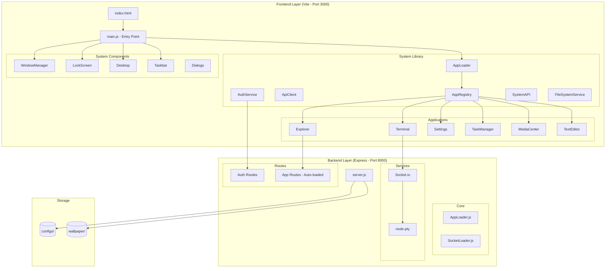
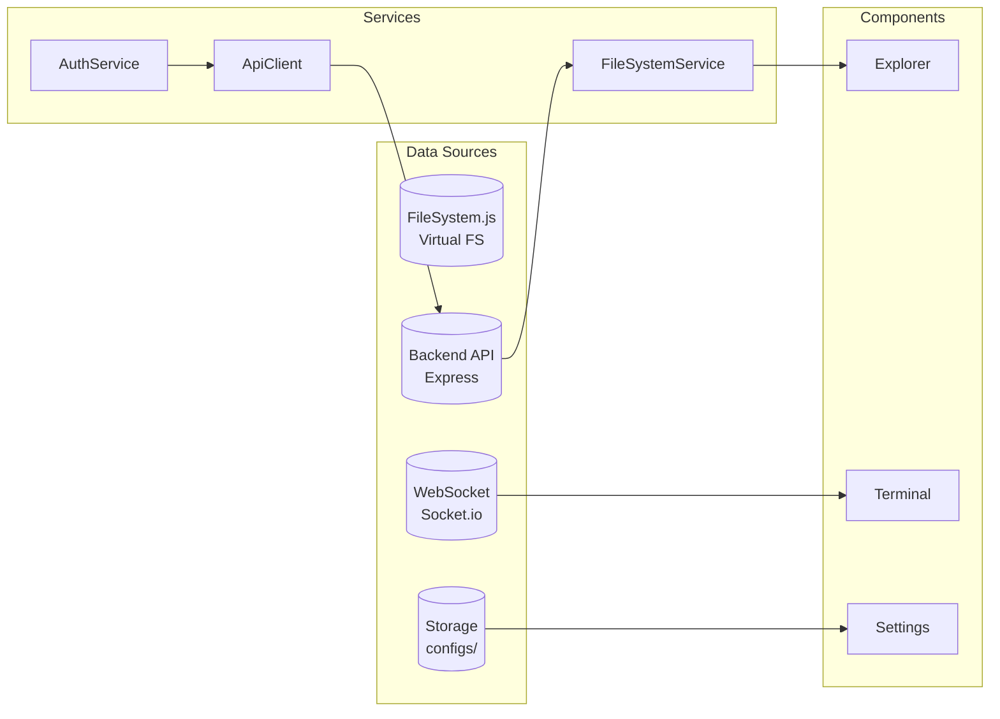
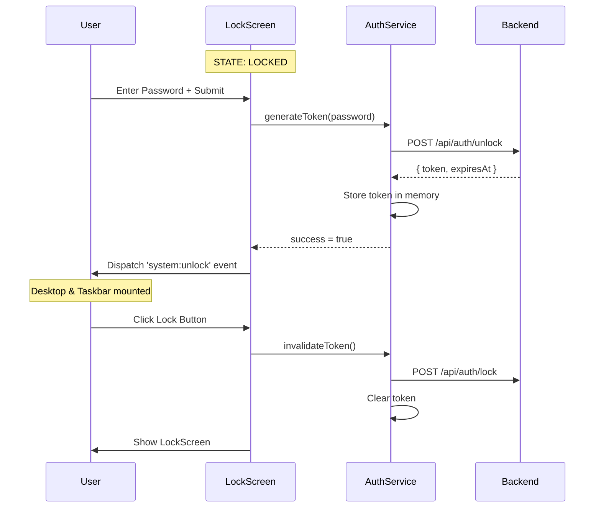
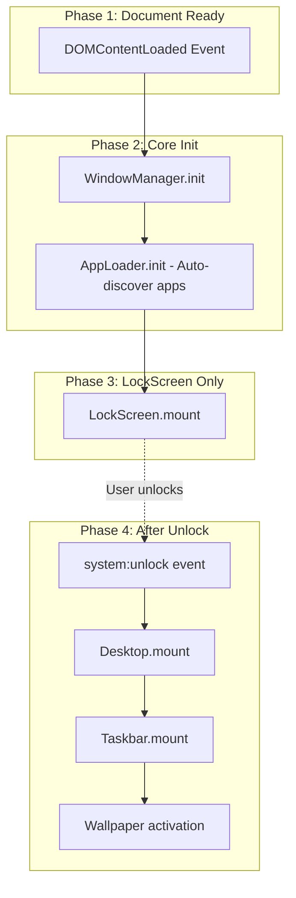
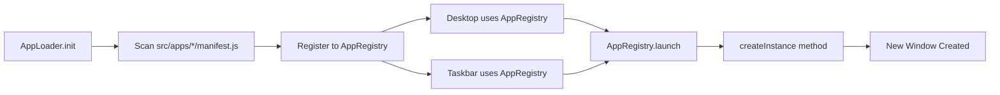

# LinuxUI Technical Analysis - Complete Documentation

> **Analysis Date:** January 18, 2026  
> **Tech Stack:** Vite 5.0, Node.js + Express, Socket.io, Vanilla JavaScript ES6, CSS3

---

## Table of Contents

1. [Architecture Overview](#1-architecture-overview)
2. [Project Directory Structure](#2-project-directory-structure)
3. [Application Components](#3-application-components)
4. [Data Architecture](#4-data-architecture)
5. [Communication Protocols & API](#5-communication-protocols--api)
6. [Security & Authentication System](#6-security--authentication-system)
7. [Data Loading Hierarchy](#7-data-loading-hierarchy-loading-priority)
8. [Application Configuration](#8-application-configuration)
9. [Development Recommendations](#9-development-recommendations)

---

## 1. Architecture Overview

### 1.1 General Description

LinuxUI is a **web-based Linux desktop simulation** application with **full-stack** architecture:
- **Frontend:** Vite + Vanilla JavaScript (ES Modules)
- **Backend:** Node.js + Express + Socket.io

The application mimics the appearance and functionality of a desktop operating system with components such as:

- **Window Manager** for window management
- **Desktop Environment** with icons and grid system
- **Taskbar** with start menu, tray icons, and calendar
- **Multiple Applications** (Explorer, Terminal, Settings, etc.)
- **Real Terminal** using xterm.js + node-pty

### 1.2 Architecture Diagram



### 1.3 Technology Stack

| Component         | Technology                       | Version |
| ----------------- | -------------------------------- | ------- |
| Build Tool        | Vite                             | ^5.0.0  |
| Backend Runtime   | Node.js                          | 18+     |
| Backend Framework | Express                          | ^4.18.2 |
| WebSocket         | Socket.io                        | ^4.x    |
| Terminal Emulator | xterm.js                         | ^5.3.0  |
| PTY Backend       | node-pty                         | ^1.0.0  |
| Icons             | Phosphor Icons                   | ^2.1.2  |
| Language          | Vanilla JavaScript (ES6 Modules) | ES2020+ |
| Styling           | CSS3 + CSS Custom Properties     | -       |

---

## 2. Project Directory Structure

```
LinuxUI/
├── index.html              # HTML entry point
├── package.json            # Frontend dependencies
├── vite.config.js          # Vite configuration + plugins
├── vite-plugin-app-api.js  # Custom plugin for app API loading
├── start_dev.sh            # Development startup script
│
├── server/                 # Backend (Node.js)
│   ├── server.js           # Entry point Express + Socket.io
│   ├── package.json        # Backend dependencies
│   ├── core/
│   │   ├── AppLoader.js    # Auto-load app routes & sockets
│   │   └── SocketLoader.js # Socket.io namespace loader
│   └── routes/             # Core server routes
│
├── storage/                # User data & assets
│   ├── configs/            # JSON configs (explorer.json, system.json)
│   └── wallpaper/          # Custom wallpapers
│
├── public/                 # Static assets (favicon, boot logo)
│
└── src/                    # Frontend (Vite)
    ├── main.js             # Application bootstrap
    │
    ├── system/
    │   ├── components/     # UI Components (Visual Layer)
    │   │   ├── Desktop/
    │   │   │   ├── Desktop.js
    │   │   │   └── style.css
    │   │   ├── LockScreen/
    │   │   │   ├── LockScreen.js
    │   │   │   ├── style.css
    │   │   │   └── api/            # Backend auth routes
    │   │   │       └── routes.js
    │   │   ├── Taskbar/
    │   │   │   ├── Taskbar.js
    │   │   │   └── style.css
    │   │   ├── WindowManager/
    │   │   │   └── WindowManager.js
    │   │   └── Dialogs/
    │   │       └── BaseDialog.js
    │   │
    │   └── lib/            # Client-side Services (Logic Layer)
    │       ├── ApiClient.js        # HTTP wrapper + auth headers
    │       ├── AuthService.js      # Session token management
    │       ├── AppLoader.js        # Dynamic app discovery
    │       ├── AppRegistry.js      # App registration & launch
    │       ├── SystemAPI.js        # Sandboxed API for apps
    │       ├── FileSystem.js       # Virtual filesystem (legacy)
    │       ├── FileSystemService.js # Real FS API bridge
    │       ├── DialogService.js    # Modal dialog system
    │       └── ExplorerService.js  # File browser utilities
    │
    ├── apps/               # Modular Applications
    │   ├── Explorer/
    │   │   ├── Explorer.js         # Frontend UI (1380 lines)
    │   │   ├── style.css
    │   │   ├── manifest.js         # App metadata
    │   │   └── api/routes.js       # Backend routes
    │   │
    │   ├── Terminal/
    │   │   ├── Terminal.js         # xterm.js integration
    │   │   ├── style.css
    │   │   ├── manifest.js
    │   │   ├── api/
    │   │   │   ├── routes.js
    │   │   │   └── socket.js       # Socket.io handlers
    │   │   └── services/
    │   │       └── TerminalSessionManager.js
    │   │
    │   ├── Settings/
    │   │   ├── Settings.js
    │   │   ├── style.css
    │   │   ├── manifest.js
    │   │   └── api/routes.js
    │   │
    │   ├── TaskManager/
    │   │   ├── TaskManager.js
    │   │   ├── style.css
    │   │   └── manifest.js
    │   │
    │   ├── MediaCenter/
    │   │   ├── MediaCenter.js
    │   │   ├── style.css
    │   │   └── manifest.js
    │   │
    │   └── TextEditor/
    │       ├── TextEditor.js
    │       ├── style.css
    │       └── manifest.js
    │
    ├── styles/
    │   └── global.css      # Global styles & CSS variables
    │
    └── assets/             # Frontend assets
```

---

## 3. Application Components

### 3.1 System Components (`src/system/components/`)

#### 3.1.1 WindowManager

| Property    | Description                                            |
| ----------- | ------------------------------------------------------ |
| **File**    | `src/system/components/WindowManager/WindowManager.js` |
| **Pattern** | Static Class (Singleton)                               |

**Functionality:**
- Z-Index management for window stacking
- Drag & drop window movement
- Window states: open, close, minimize, maximize
- Multi-edge resize (all corners & edges)
- Event delegation for mouse events

**API Methods:**

```javascript
WindowManager.init()              // Initialize global listeners
WindowManager.toggleWindow(id)    // Toggle window visibility
WindowManager.openWindow(id)      // Open window
WindowManager.closeWindow(id)     // Close window
WindowManager.maximizeWindow(id)  // Toggle maximize
WindowManager.minimizeWindow(id)  // Minimize window
WindowManager.bringToFront(el)    // Raise z-index
```

---

#### 3.1.2 LockScreen

| Property    | Description                                      |
| ----------- | ------------------------------------------------ |
| **File**    | `src/system/components/LockScreen/LockScreen.js` |
| **Lines**   | 131 lines                                        |
| **Pattern** | Static Class                                     |

**Functionality:**
- Lock screen with password input
- **AuthService integration** for token management
- Unlock animation (slide up)
- Shake animation for wrong password
- Offline fallback mode

**API Methods:**

```javascript
LockScreen.mount(container)    // Render lockscreen to container
LockScreen.attachListeners()   // Setup event handlers
LockScreen.checkUnlock(e)      // Handle Enter key
LockScreen.performUnlock()     // Validate via AuthService & unlock
LockScreen.performLock()       // Lock screen & invalidate token
LockScreen.showError(message)  // Display error message
```

**Event Dispatching:**
```javascript
// Fired after successful unlock
document.dispatchEvent(new CustomEvent('system:unlock'));
```

---

#### 3.1.3 Desktop

| Property    | Description                                |
| ----------- | ------------------------------------------ |
| **File**    | `src/system/components/Desktop/Desktop.js` |
| **Lines**   | 343 lines                                  |
| **Pattern** | Static Class                               |

**Functionality:**
- Grid-based icon placement (20x10 grid)
- Icon drag & drop with snap-to-grid
- Context menu (right-click)
- **Dynamic icons via AppRegistry**

**API Methods:**

```javascript
Desktop.mount(container)              // Render desktop
Desktop.initializeGrid()              // Setup grid system
Desktop.placeIconAtGrid(icon, col, row)  // Place icon
Desktop.getGridFromPosition(x, y)     // Coordinates to grid cell
Desktop.findNearestFreeCell(col, row) // Find empty cell
Desktop.attachListeners()             // Event handlers
Desktop.closeAllMenus()               // Close context menus
Desktop.handleContextAction(action)   // Handle context menu
Desktop.arrangeIcons()                // Auto-arrange icons
```

---

#### 3.1.4 Taskbar

| Property    | Description                                |
| ----------- | ------------------------------------------ |
| **File**    | `src/system/components/Taskbar/Taskbar.js` |
| **Lines**   | 759 lines                                  |
| **Pattern** | Static Class                               |

**Functionality:**
- Start menu with application search
- **Dynamic app icons via AppRegistry**
- System tray (WiFi, Volume, Battery)
- Calendar widget with month navigation
- Quick notes
- Real-time clock
- **Window preview on hover**

**API Methods:**

```javascript
Taskbar.mount(container)             // Render taskbar
Taskbar.attachListeners()            // Event handlers
Taskbar.addNote(text)                // Add note
Taskbar.closeAllPopups()             // Close all popups
Taskbar.togglePopup(id)              // Toggle popup visibility
Taskbar.startClock()                 // Run clock updater
Taskbar.renderCalendar(date)         // Render calendar grid
Taskbar.showWindowPreview(...)       // Show running instances
Taskbar.openNewAppWindow(appType)    // Launch new instance
```

---

### 3.2 System Library (`src/system/lib/`)

| File                   | Lines | Description                                 |
| ---------------------- | ----- | ------------------------------------------- |
| `ApiClient.js`         | 80    | HTTP wrapper with auto-auth headers         |
| `AuthService.js`       | 111   | Session token management (unlock/lock)      |
| `AppLoader.js`         | ~90   | Dynamic app discovery from `src/apps/`      |
| `AppRegistry.js`       | 134   | App registration, launch, & icon generation |
| `SystemAPI.js`         | ~150  | Sandboxed API for each app                  |
| `FileSystem.js`        | ~80   | Virtual filesystem (legacy fallback)        |
| `FileSystemService.js` | ~150  | Real filesystem API bridge                  |
| `DialogService.js`     | ~400  | Modal dialog system                         |
| `ExplorerService.js`   | ~80   | File browser utilities                      |

---

### 3.3 Applications

#### 3.3.1 App Manifest Structure

Each application has a `manifest.js` file defining its metadata:

```javascript
// src/apps/Explorer/manifest.js
export default {
    id: 'explorer',
    name: 'File Explorer',
    shortName: 'Explorer',
    icon: 'ph-folder',
    iconPath: '<path d="M..."/>',
    color: '#FFB900',
    showOnDesktop: true,
    showOnTaskbar: true,
    permissions: ['filesystem', 'dialog', 'storage'],
    createInstance: async (options, systemAPI) => {
        const { Explorer } = await import('./Explorer.js');
        return Explorer.createNewInstance(options);
    }
};
```

#### 3.3.2 Explorer (File Manager)

| Property    | Description                     |
| ----------- | ------------------------------- |
| **File**    | `src/apps/Explorer/Explorer.js` |
| **Lines**   | 1380 lines                      |
| **Pattern** | Static Class + Multi-instance   |

**Features:**
- Filesystem navigation (real backend or virtual)
- Breadcrumb navigation
- Dual view mode (grid/list)
- Context menu with file operations
- File tooltips with detailed info
- Network connection (FTP via basic-ftp)
- Clipboard (cut/copy/paste)
- **API routes available**

**Instance State:**
```javascript
static instances = new Map();  // windowId -> { path, viewMode, etc }
```

**File Operations (via Backend):**
- Open, Cut, Copy, Paste, Delete, Rename
- New Folder, New File
- Toggle Hidden Files
- Connect to Network (FTP)

---

#### 3.3.3 Terminal

| Property    | Description                     |
| ----------- | ------------------------------- |
| **File**    | `src/apps/Terminal/Terminal.js` |
| **Lines**   | 376 lines                       |
| **Pattern** | Static Class + Multi-instance   |

**Features:**
- **Real PTY** via node-pty backend
- **xterm.js** terminal emulator
- Multi-tab terminal per window
- WebSocket communication via Socket.io
- Auto-resize with FitAddon

**Architecture:**
```
Frontend (xterm.js) ←→ Socket.io ←→ Backend (node-pty)
```

**Key Files:**
- `Terminal.js` - Frontend UI
- `api/socket.js` - Socket.io handlers
- `services/TerminalSessionManager.js` - PTY session management

---

#### 3.3.4 Settings

| Property    | Description                     |
| ----------- | ------------------------------- |
| **File**    | `src/apps/Settings/Settings.js` |
| **Pattern** | Static Class + Multi-instance   |

**Sections:**
- **System** - Info & About
- **Display** - Resolution, brightness
- **Personalization** - Themes, wallpaper (with backend save)
- **Network** - WiFi, Ethernet
- **Apps** - Installed apps
- **Privacy** - Security settings
- **Time & Language** - Locale settings
- **Accessibility** - A11y options
- **Update** - System updates

---

#### 3.3.5 TaskManager

| Property    | Description                           |
| ----------- | ------------------------------------- |
| **File**    | `src/apps/TaskManager/TaskManager.js` |
| **Pattern** | Static Class + Multi-instance         |

**Tabs:**
- **Processes** - Running processes (mock data)
- **Performance** - CPU/Memory graphs
- **Startup** - Autostart programs
- **Services** - System services

---

#### 3.3.6 MediaCenter

| Property    | Description                           |
| ----------- | ------------------------------------- |
| **File**    | `src/apps/MediaCenter/MediaCenter.js` |
| **Pattern** | Static Class + Multi-instance         |

**Features:**
- Media library with mock data
- Filter: All, Music, Videos, Photos
- Media player bar with controls

---

#### 3.3.7 TextEditor

| Property    | Description                         |
| ----------- | ----------------------------------- |
| **File**    | `src/apps/TextEditor/TextEditor.js` |
| **Pattern** | Static Class + Multi-instance       |

**Features:**
- Basic text editing
- File operations (New, Open, Save)
- Edit operations (Undo, Cut, Copy, Paste)
- Word wrap toggle
- Line/column indicator

---

## 4. Data Architecture

### 4.1 FileSystem

**Virtual Filesystem (Legacy Fallback):**
> **Location:** `src/system/lib/FileSystem.js`

Used when backend is unavailable.

**Real Filesystem API:**
> **Location:** `src/system/lib/FileSystemService.js`

Bridge to backend API for real file operations.

### 4.2 Storage Folder

```
storage/
├── configs/           # Application configs
│   ├── explorer.json  # Explorer settings
│   ├── system.json    # System preferences
│   └── ...
└── wallpaper/         # Custom wallpaper images
```

### 4.3 Data Flow Diagram



### 4.4 State Management Pattern

Applications use **Multi-Instance Pattern** with Map:

```javascript
// Each app stores state per window
static instances = new Map();  // windowId -> instanceState

// Example state
instances.set(windowId, {
    path: '/home/user',
    viewMode: 'grid',
    socket: socketConnection,
    terminal: xtermInstance
});
```

| Component | State Storage                  | Persistence     |
| --------- | ------------------------------ | --------------- |
| Explorer  | `instances` Map + Backend      | ✅ Backend-saved |
| Terminal  | `instances` Map                | Session only    |
| Settings  | `instances` Map + localStorage | ✅ Partial       |

---

## 5. Communication Protocols & API

### 5.1 Implementation Status

| Protocol      | Status        | Details                              |
| ------------- | ------------- | ------------------------------------ |
| HTTP REST API | ✅ Implemented | Express on port 8000                 |
| WebSocket     | ✅ Implemented | Socket.io for Terminal               |
| Auth API      | ✅ Implemented | `/api/auth/unlock`, `/api/auth/lock` |
| File API      | ✅ Implemented | `/api/explorer/*`                    |
| Settings API  | ✅ Implemented | `/api/settings/*`                    |

### 5.2 Server Entry Point

**File:** `server/server.js`

```javascript
const PORT = 8000;

// Core Routes
app.use('/api/auth', authRoutes);

// App Routes (auto-loaded from each app's api/routes.js)
await loadAppRoutes(app);  // Loads Explorer, Settings, etc.

// WebSocket
await loadAppSockets(io);  // Loads Terminal sockets
```

### 5.3 API Endpoints

#### Authentication API

| Method | Endpoint           | Description              |
| ------ | ------------------ | ------------------------ |
| `POST` | `/api/auth/unlock` | Generate session token   |
| `POST` | `/api/auth/lock`   | Invalidate session token |
| `GET`  | `/api/health`      | Server health check      |

**POST /api/auth/unlock:**
```json
// Request
{ "password": "123", "clientId": "linuxui-web-client" }

// Response
{
    "success": true,
    "token": "sess_abc123...",
    "expiresAt": "2026-01-18T22:00:00Z",
    "userId": "user",
    "permissions": ["fs_read", "fs_write", "terminal"]
}
```

#### File System API (Explorer)

| Method   | Endpoint                   | Description        |
| -------- | -------------------------- | ------------------ |
| `GET`    | `/api/explorer/list?path=` | List directory     |
| `POST`   | `/api/explorer/mkdir`      | Create directory   |
| `POST`   | `/api/explorer/create`     | Create file        |
| `DELETE` | `/api/explorer/delete`     | Delete file/folder |
| `POST`   | `/api/explorer/rename`     | Rename item        |
| `POST`   | `/api/explorer/copy`       | Copy item          |
| `POST`   | `/api/explorer/move`       | Move item          |

#### Settings API

| Method | Endpoint                           | Description          |
| ------ | ---------------------------------- | -------------------- |
| `GET`  | `/api/settings/wallpapers/current` | Get active wallpaper |
| `POST` | `/api/settings/wallpapers`         | Set wallpaper        |
| `GET`  | `/api/settings/config/:name`       | Get config file      |
| `POST` | `/api/settings/config/:name`       | Save config file     |

#### Terminal WebSocket

| Event              | Direction     | Payload                     |
| ------------------ | ------------- | --------------------------- |
| `terminal:create`  | Client→Server | `{ sessionId }`             |
| `terminal:data`    | Bidirectional | `{ sessionId, data }`       |
| `terminal:resize`  | Client→Server | `{ sessionId, cols, rows }` |
| `terminal:destroy` | Client→Server | `{ sessionId }`             |

---

## 6. Security & Authentication System

### 6.1 Session Token Architecture

> [!IMPORTANT]
> The system uses **Session Tokens** that are generated on unlock and invalidated on lock.

| State            | Token Status    | API Access             |
| ---------------- | --------------- | ---------------------- |
| **Unlocked**     | ✅ Token Valid   | ✅ All APIs accessible  |
| **Locked**       | ❌ Token Expired | ❌ API rejects requests |
| **Page Refresh** | 🗑️ Token cleared | ❌ Must unlock again    |

### 6.2 AuthService Implementation

**File:** `src/system/lib/AuthService.js` (111 lines)

```javascript
export class AuthService {
    static sessionToken = null;
    static tokenExpiry = null;
    static isLocked = true;
    static userId = null;
    static permissions = [];

    static API_BASE = 'http://localhost:8000/api';
    static TOKEN_HEADER = 'X-Session-Token';
    static LOCK_STATE_HEADER = 'X-LockScreen-State';

    static async generateToken(password) { ... }
    static async invalidateToken() { ... }
    static getAuthHeaders() { ... }
    static isTokenExpired() { ... }
    static isSessionActive() { ... }
    static getToken() { ... }
}
```

### 6.3 ApiClient Implementation

**File:** `src/system/lib/ApiClient.js` (80 lines)

```javascript
export class ApiClient {
    static BASE_URL = 'http://localhost:8000/api';

    static async request(endpoint, options = {}) {
        if (!AuthService.isSessionActive()) {
            throw new Error('SESSION_LOCKED');
        }
        
        const headers = {
            'Content-Type': 'application/json',
            ...AuthService.getAuthHeaders(),
            ...options.headers
        };
        
        // ... fetch with auto 401 handling
    }

    static async get(endpoint) { ... }
    static async post(endpoint, data) { ... }
    static async delete(endpoint) { ... }
    static triggerLockScreen() { ... }
}
```

### 6.4 Security Flow Diagram



### 6.5 Security Best Practices

> [!CAUTION]
> Token is stored in **memory only**, NOT in localStorage/cookies.

1. ✅ Token does not persist - Lost on refresh
2. ✅ Immediate invalidation on lock
3. ✅ Server-side validation on every request
4. ✅ Token cleared on `beforeunload` event

---

## 7. Data Loading Hierarchy (Loading Priority)

### 7.1 Initialization Sequence



### 7.2 Priority Table

| Priority | Component     | Reason                    | Z-Index |
| -------- | ------------- | ------------------------- | ------- |
| 1        | WindowManager | Core dependency           | -       |
| 2        | AppLoader     | Discover all apps         | -       |
| 3        | LockScreen    | Security first            | 9999+   |
| 4        | Desktop       | Base layer (after unlock) | 1       |
| 5        | Taskbar       | UI controls               | 9000+   |
| 6        | Applications  | On-demand                 | 100+    |

### 7.3 App Loading Flow



---

## 8. Application Configuration

### 8.1 Vite Configuration

**File:** `vite.config.js`

```javascript
import { defineConfig } from 'vite';
import { appApiPlugin } from './vite-plugin-app-api.js';

export default defineConfig({
    plugins: [
        appApiPlugin(),           // Auto-load app API endpoints
        { name: 'block-backend-files', ... },  // Prevent access to api/ folders
        { name: 'serve-storage', ... }         // Serve /storage/ files
    ],
    resolve: {
        alias: { '@': './src' }
    },
    server: {
        port: 3000,
        fs: {
            allow: ['./', './storage'],
            deny: ['**/src/apps/**/api/**', '**/src/apps/**/services/**']
        }
    }
});
```

### 8.2 Backend Configuration

**File:** `server/package.json`

```json
{
    "type": "module",
    "scripts": {
        "start": "node server.js"
    },
    "dependencies": {
        "cors": "^2.8.5",
        "express": "^4.18.2",
        "multer": "^1.4.5-lts.1",
        "node-pty": "^1.0.0",
        "socket.io": "^4.6.1",
        "uuid": "^9.0.1"
    }
}
```

**Server Configuration (server.js):**

| Setting                | Value                 |
| ---------------------- | --------------------- |
| Port                   | 8000                  |
| CORS                   | Enabled (all origins) |
| JSON Limit             | 10mb                  |
| Socket.io pingTimeout  | 60000ms               |
| Socket.io pingInterval | 25000ms               |

### 8.3 CSS Design Tokens

**File:** `src/styles/global.css`

```css
:root {
    --bg-wallpaper: #1a1a2e url('...') no-repeat center center fixed;
    --acrylic-bg: rgba(255, 255, 255, 0.75);
    --window-border: 1px solid rgba(255, 255, 255, 0.4);
    --dock-bg: rgba(20, 20, 20, 0.85);
    --shadow-lg: 0 15px 40px rgba(0, 0, 0, 0.25);
    --accent-color: #0078d4;
    --text-primary: #202020;
}
```

---

## 9. Development Recommendations

### 9.1 Feature Status

| Feature                | Status        | Notes                    |
| ---------------------- | ------------- | ------------------------ |
| Backend Integration    | ✅ Implemented | Express + Socket.io      |
| File System API        | ✅ Implemented | Full CRUD                |
| Terminal Backend       | ✅ Implemented | node-pty + xterm.js      |
| Auth System            | ✅ Implemented | Token-based              |
| LocalStorage           | ✅ Partial     | Wallpaper, some settings |
| API Service Layer      | ✅ Implemented | ApiClient, SystemAPI     |
| App Manifest System    | ✅ Implemented | Auto-discovery           |
| Multi-Instance Windows | ✅ Implemented | All apps                 |

### 9.2 Future Improvements

1. **Redis Token Store** - For multi-server deployment
2. **Rate Limiting** - On auth endpoints
3. **Audit Logging** - Track lock/unlock events
4. **IndexedDB** - For offline file caching
5. **Service Worker** - PWA support

### 9.3 Development Commands

```bash
# Frontend (Vite)
npm install          # Install dependencies
npm run dev          # Start dev server (port 3000)

# Backend (Node.js)
cd server
npm install          # Install backend dependencies
npm start            # Start server (port 8000)

# Or use startup script
./start_dev.sh       # Start both frontend & backend
```

---

## Appendix

### A. File Size Reference

| File           | Lines | Size    |
| -------------- | ----- | ------- |
| Explorer.js    | 1380  | 65.4 KB |
| Taskbar.js     | 759   | 33.1 KB |
| Terminal.js    | 376   | 11.4 KB |
| Desktop.js     | 343   | 13.3 KB |
| AppRegistry.js | 134   | 3.8 KB  |
| LockScreen.js  | 131   | 4.4 KB  |
| AuthService.js | 111   | 3.1 KB  |
| ApiClient.js   | 80    | 2.1 KB  |
| server.js      | 183   | 5.8 KB  |

### B. Port Reference

| Service         | Port | Protocol |
| --------------- | ---- | -------- |
| Vite Dev Server | 3000 | HTTP     |
| Backend API     | 8000 | HTTP     |
| WebSocket       | 8000 | WS       |

---

> **Document updated on:** January 18, 2026  
> **Revision:** Full-stack architecture, AuthService implemented, Terminal real PTY
